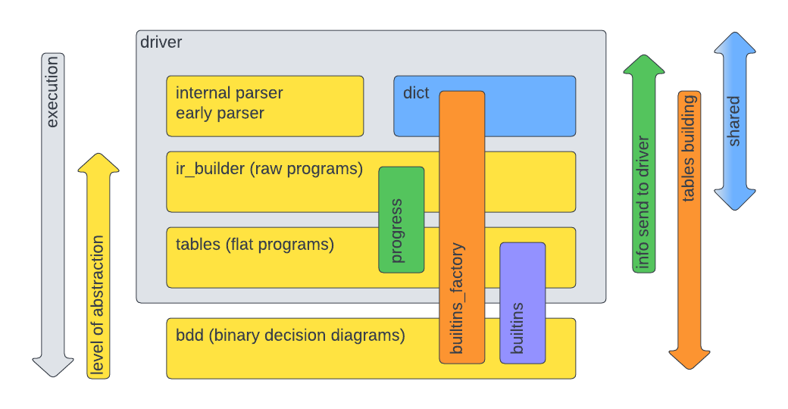

# Architecture

## Overview

The architecture of TML is organized in differents layers according to the 
level of abstraction of the representation of the TML program:

* plain text/raw programs: at this level, TML manages the input 
and the intermediate representation obtained after parsing the input. The output
of the parser are called raw programs and gives a structured representation of 
the program close to the provided input,
* flat programs: flat programs are a structured representation which is closer to
the execution than raw programs, and
* binary decision diagram: is the final representation of the TML program and 
give us the results of the execution of the TML program.

The driver component governs the overall execution of the TML guiding the 
different transformations between representations and executing the final result. 
To do so, the driver use the rest of components: parsers, ir_builder, tables,
bdd...

The following diagram gives an overall view of the different components:

A description of their functionality is given in later sections.

## Main components

The main components of the TML architecture are:

* driver: It governs the execution of TML programs from reading,
parsing and tranforming the input to its execution and output. 

* tables: It controls the execution and required transforms of flat programs and 
its conversion to binary decision diagrams.

* bdd library: Highly efficient of implementation of binary decision diagrams data 
structure. They represent the most concrete representation of the TML program
and serves as a computing engine for its execution. 

* ir_builder: It transforms initial structured program representation, 
raw programs, into the flat programs.

## Other components

Another components of the TML architecture are:

* dictionary: It keeps track of the symbol/numeric value to be used in the 
forthcoming modules. It is main goal is to compress the information mapping 
lexemes to integers. 

* parser/early parser: They obviously deal with the parsing of the input.

Finally, the neccesary interaction between driver, tables and bdd components are
encapsulated in the following components:

* builtins/builtins_factory: builtins deal with predefined actions on TML. Whereas 
builtins_factory encapsulatestheir creation

* progress monitor: It deals with the communication between tables and driver, 
notifying the former points of interest to the later. 

